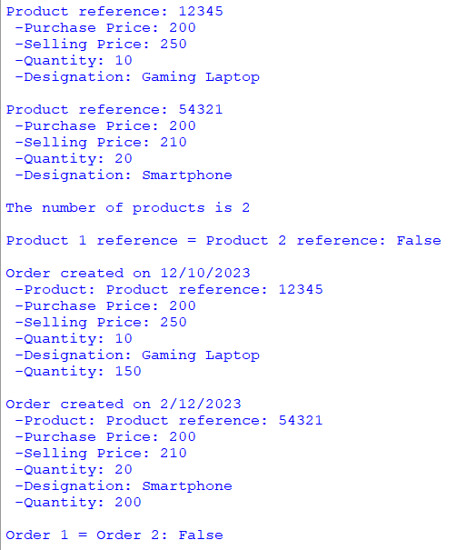

## Description
This program is designed for commercial management. The 'Product' class allows the creation and management of product attributes, while the 'Order' class enables the recording and handling of order-specific information. This program demonstrates encapsulation principles and serves as a starting point for developing systems to manage products and orders efficiently.
## Example

